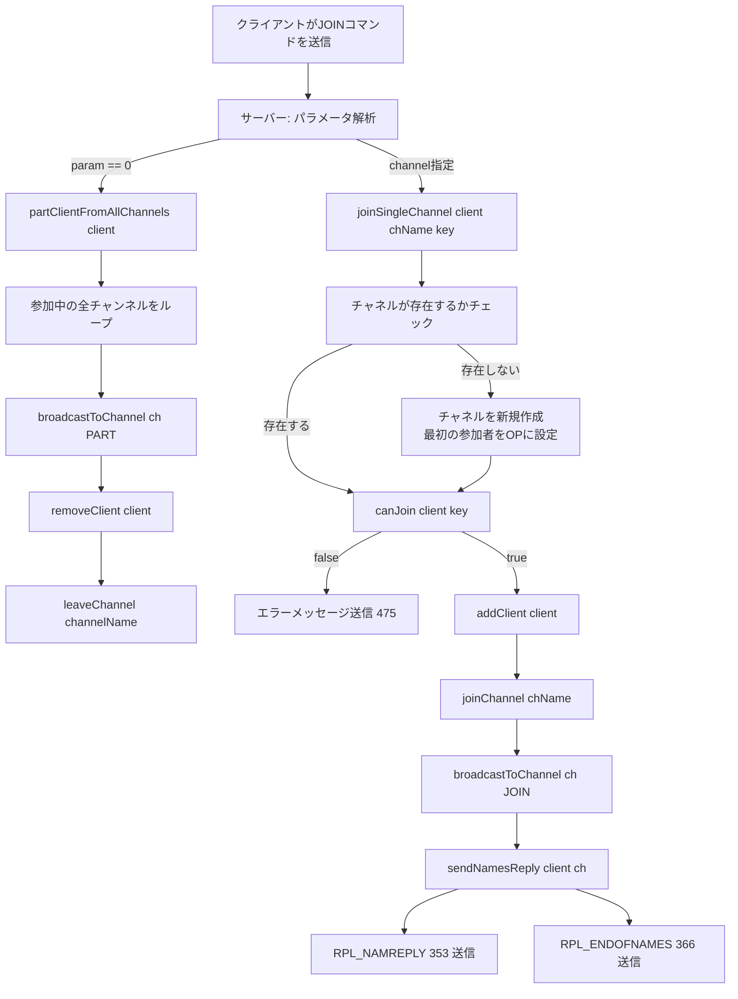
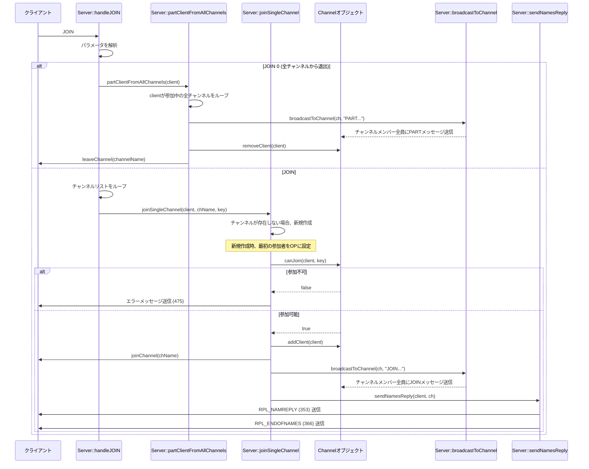

```mermaid
flowchart TD
    Start[クライアントがJOINコマンドを送信]
    Parse[サーバー: パラメータ解析]
    Start --> Parse

    Parse -->|param == 0| PartAllCall[partClientFromAllChannels client]
    PartAllCall --> Loop[参加中の全チャンネルをループ]
    Loop --> BroadcastPART[broadcastToChannel ch PART]
    BroadcastPART --> Remove[removeClient client]
    Remove --> Leave[leaveChannel channelName]

    Parse -->|channel指定| JoinSingleCall[joinSingleChannel client chName key]
    JoinSingleCall --> ExistsCheck[チャネルが存在するかチェック]
    ExistsCheck -->|存在しない| Create[チャネルを新規作成<br>最初の参加者をOPに設定]
    ExistsCheck -->|存在する| CanJoin[canJoin client key]
    Create --> CanJoin
    CanJoin -->|false| Reject[エラーメッセージ送信 475]
    CanJoin -->|true| Add[addClient client]
    Add --> JoinClient[joinChannel chName]
    JoinClient --> BroadcastJOIN[broadcastToChannel ch JOIN]
    BroadcastJOIN --> SendNames[sendNamesReply client ch]
    SendNames --> RPL353[RPL_NAMREPLY 353 送信]
    SendNames --> RPL366[RPL_ENDOFNAMES 366 送信]
```

```mermaid
sequenceDiagram
    participant Client as クライアント
    participant Server as Server::handleJOIN
    participant PartAll as Server::partClientFromAllChannels
    participant JoinSingle as Server::joinSingleChannel
    participant Channel as Channelオブジェクト
    participant Broadcast as Server::broadcastToChannel
    participant NamesReply as Server::sendNamesReply

    Client->>Server: JOIN #channel or JOIN 0
    Server->>Server: パラメータを解析

    alt JOIN 0 (全チャンネルから退出)
        Server->>PartAll: partClientFromAllChannels(client)
        PartAll->>PartAll: clientが参加中の全チャンネルをループ
        PartAll->>Broadcast: broadcastToChannel(ch, "PART...")
        Broadcast-->>Channel: チャンネルメンバー全員にPARTメッセージ送信
        PartAll->>Channel: removeClient(client)
        PartAll->>Client: leaveChannel(channelName)
    else JOIN #channel (特定チャンネルに参加)
        Server->>Server: チャンネルリストをループ
        Server->>JoinSingle: joinSingleChannel(client, chName, key)
        JoinSingle->>JoinSingle: チャンネルが存在しない場合、新規作成
        Note over JoinSingle: 新規作成時、最初の参加者をOPに設定
        JoinSingle->>Channel: canJoin(client, key)
        alt 参加不可
            Channel-->>JoinSingle: false
            JoinSingle->>Client: エラーメッセージ送信 (475)
        else 参加可能
            Channel-->>JoinSingle: true
            JoinSingle->>Channel: addClient(client)
            JoinSingle->>Client: joinChannel(chName)
            JoinSingle->>Broadcast: broadcastToChannel(ch, "JOIN...")
            Broadcast-->>Channel: チャンネルメンバー全員にJOINメッセージ送信
            JoinSingle->>NamesReply: sendNamesReply(client, ch)
            NamesReply->>Client: RPL_NAMREPLY (353) 送信
            NamesReply->>Client: RPL_ENDOFNAMES (366) 送信
        end
    end
```
