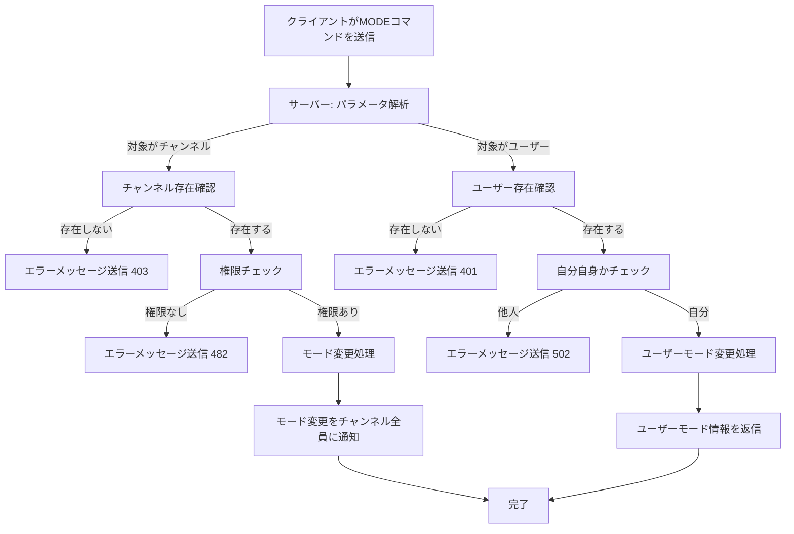
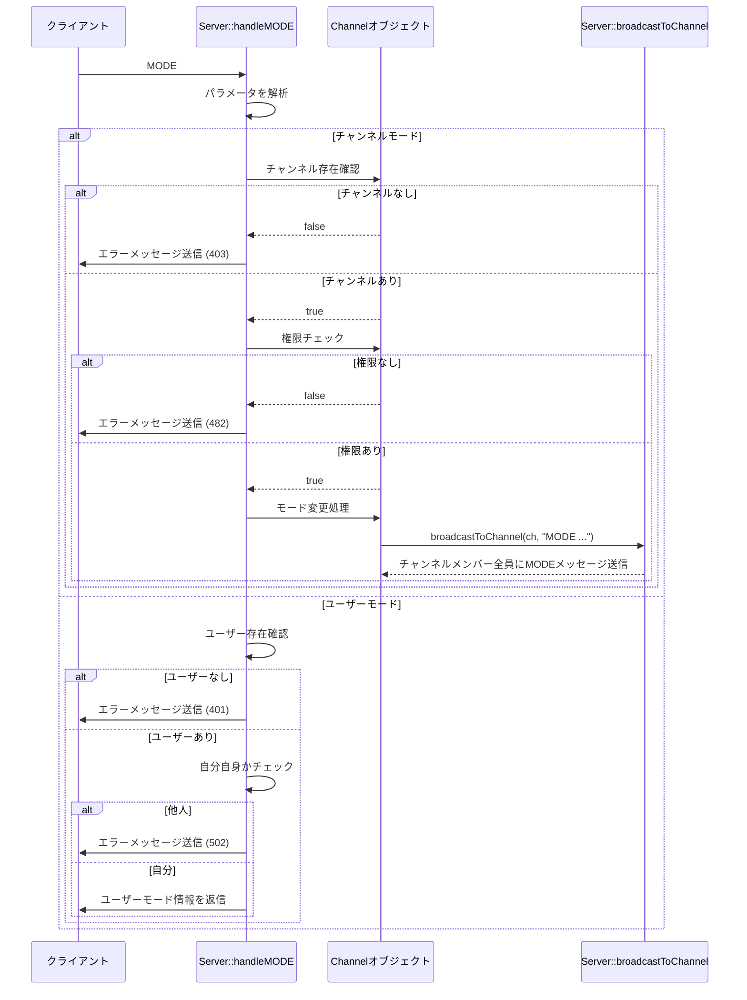

```mermaid
flowchart TD
    Start[クライアントがMODEコマンドを送信]
    Parse[サーバー: パラメータ解析]
    Start --> Parse

    Parse -->|対象がチャンネル| ChannelCheck[チャンネル存在確認]
    ChannelCheck -->|存在しない| ErrorNoChannel[エラーメッセージ送信 403]
    ChannelCheck -->|存在する| PrivCheck[権限チェック]
    PrivCheck -->|権限なし| ErrorNoPriv[エラーメッセージ送信 482]
    PrivCheck -->|権限あり| ApplyMode[モード変更処理]
    ApplyMode --> BroadcastMode[モード変更をチャンネル全員に通知]
    BroadcastMode --> End[完了]

    Parse -->|対象がユーザー| UserCheck[ユーザー存在確認]
    UserCheck -->|存在しない| ErrorNoUser[エラーメッセージ送信 401]
    UserCheck -->|存在する| SelfCheck[自分自身かチェック]
    SelfCheck -->|他人| ErrorUsersDontMatch[エラーメッセージ送信 502]
    SelfCheck -->|自分| ApplyUserMode[ユーザーモード変更処理]
    ApplyUserMode --> ReplyUserMode[ユーザーモード情報を返信]
    ReplyUserMode --> End
```

```mermaid
sequenceDiagram
    participant Client as クライアント
    participant Server as Server::handleMODE
    participant Channel as Channelオブジェクト
    participant Broadcast as Server::broadcastToChannel

    Client->>Server: MODE #channel/+mode/-mode ...
    Server->>Server: パラメータを解析
    alt チャンネルモード
        Server->>Channel: チャンネル存在確認
        alt チャンネルなし
            Channel-->>Server: false
            Server->>Client: エラーメッセージ送信 (403)
        else チャンネルあり
            Channel-->>Server: true
            Server->>Channel: 権限チェック
            alt 権限なし
                Channel-->>Server: false
                Server->>Client: エラーメッセージ送信 (482)
            else 権限あり
                Channel-->>Server: true
                Server->>Channel: モード変更処理
                Channel->>Broadcast: broadcastToChannel(ch, "MODE ...")
                Broadcast-->>Channel: チャンネルメンバー全員にMODEメッセージ送信
            end
        end
    else ユーザーモード
        Server->>Server: ユーザー存在確認
        alt ユーザーなし
            Server->>Client: エラーメッセージ送信 (401)
        else ユーザーあり
            Server->>Server: 自分自身かチェック
            alt 他人
                Server->>Client: エラーメッセージ送信 (502)
            else 自分
                Server->>Client: ユーザーモード情報を返信
            end
        end
    end
```
