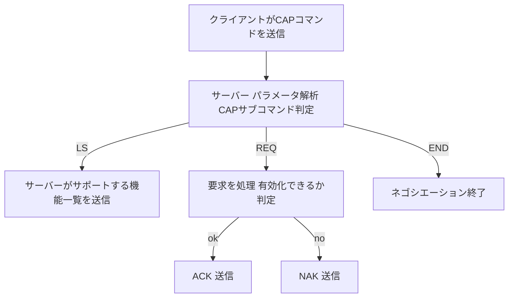
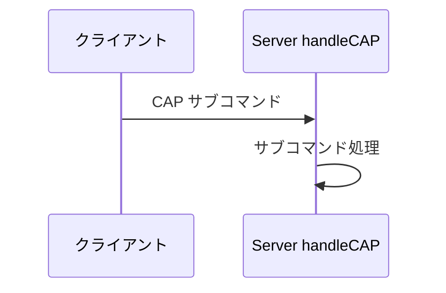

```mermaid
flowchart TD
    Start[クライアントがCAPコマンドを送信]
    Parse[サーバー パラメータ解析 CAPサブコマンド判定]
    Start --> Parse

    Parse -->|LS| SendList[サーバーがサポートする機能一覧を送信]
    Parse -->|REQ| HandleReq[要求を処理 有効化できるか判定]
    HandleReq -->|ok| Ack[ACK 送信]
    HandleReq -->|no| Nak[NAK 送信]
    Parse -->|END| End[ネゴシエーション終了]
```

```mermaid
sequenceDiagram
    participant Client as クライアント
    participant Server as Server handleCAP
    Client->>Server: CAP サブコマンド
    Server->>Server: サブコマンド処理
```
