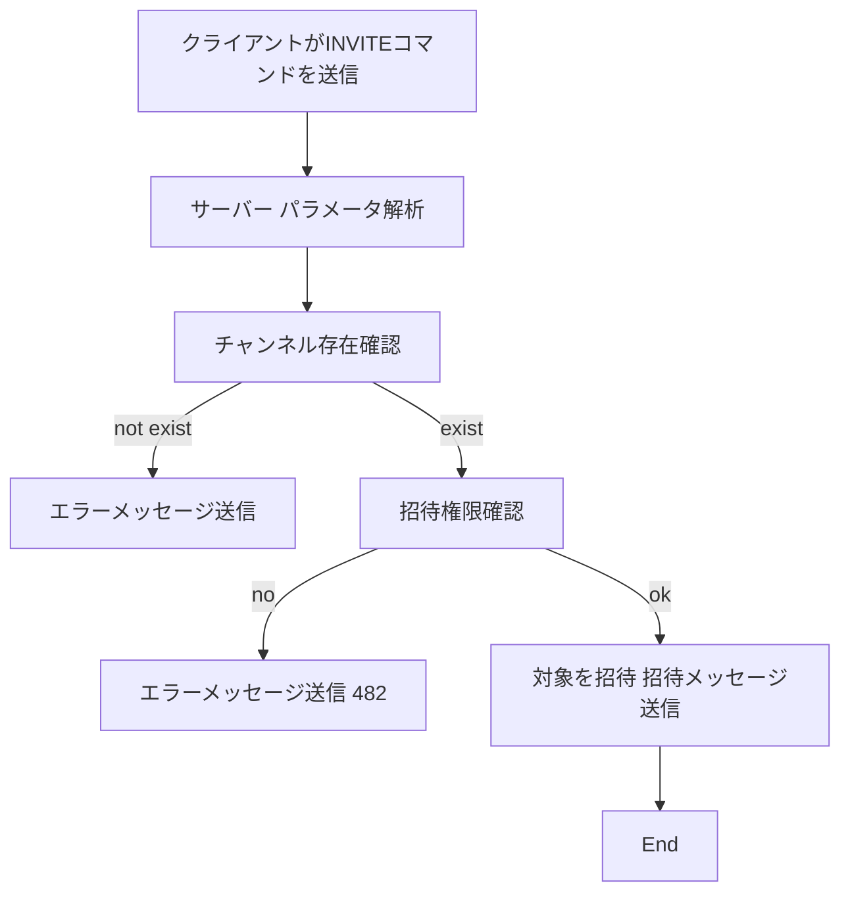
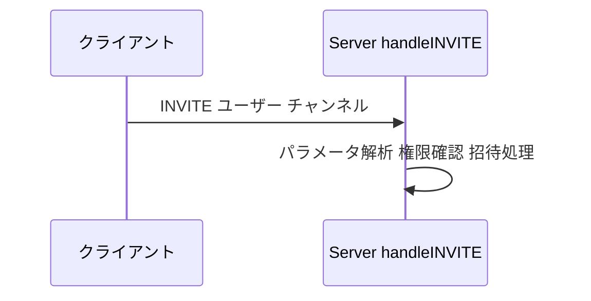

```mermaid
flowchart TD
    Start[クライアントがINVITEコマンドを送信]
    Parse[サーバー パラメータ解析]
    Start --> Parse

    Parse --> ChannelCheck[チャンネル存在確認]
    ChannelCheck -->|not exist| Error[エラーメッセージ送信]
    ChannelCheck -->|exist| PrivCheck[招待権限確認]
    PrivCheck -->|no| Error482[エラーメッセージ送信 482]
    PrivCheck -->|ok| InviteUser[対象を招待 招待メッセージ送信]
    InviteUser --> End
```

```mermaid
sequenceDiagram
    participant Client as クライアント
    participant Server as Server handleINVITE
    Client->>Server: INVITE ユーザー チャンネル
    Server->>Server: パラメータ解析 権限確認 招待処理
```
