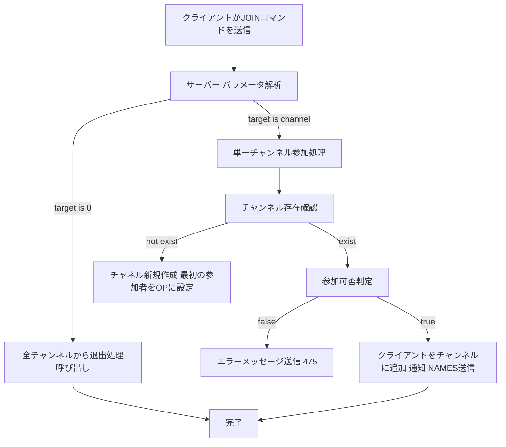
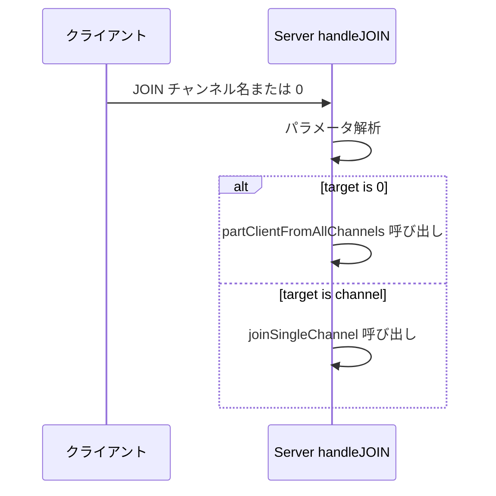

```mermaid
flowchart TD
    Start[クライアントがJOINコマンドを送信]
    Parse[サーバー パラメータ解析]
    Start --> Parse

    Parse -->|target is 0| PartAll[全チャンネルから退出処理呼び出し]
    PartAll --> End[完了]

    Parse -->|target is channel| JoinSingle[単一チャンネル参加処理]
    JoinSingle --> ExistsCheck[チャンネル存在確認]
    ExistsCheck -->|not exist| Create[チャネル新規作成 最初の参加者をOPに設定]
    ExistsCheck -->|exist| CanJoin[参加可否判定]
    CanJoin -->|false| Reject[エラーメッセージ送信 475]
    CanJoin -->|true| Add[クライアントをチャンネルに追加 通知 NAMES送信]
    Add --> End
```

```mermaid
sequenceDiagram
    participant Client as クライアント
    participant Server as Server handleJOIN
    Client->>Server: JOIN チャンネル名または 0
    Server->>Server: パラメータ解析
    alt target is 0
        Server->>Server: partClientFromAllChannels 呼び出し
    else target is channel
        Server->>Server: joinSingleChannel 呼び出し
    end
```
