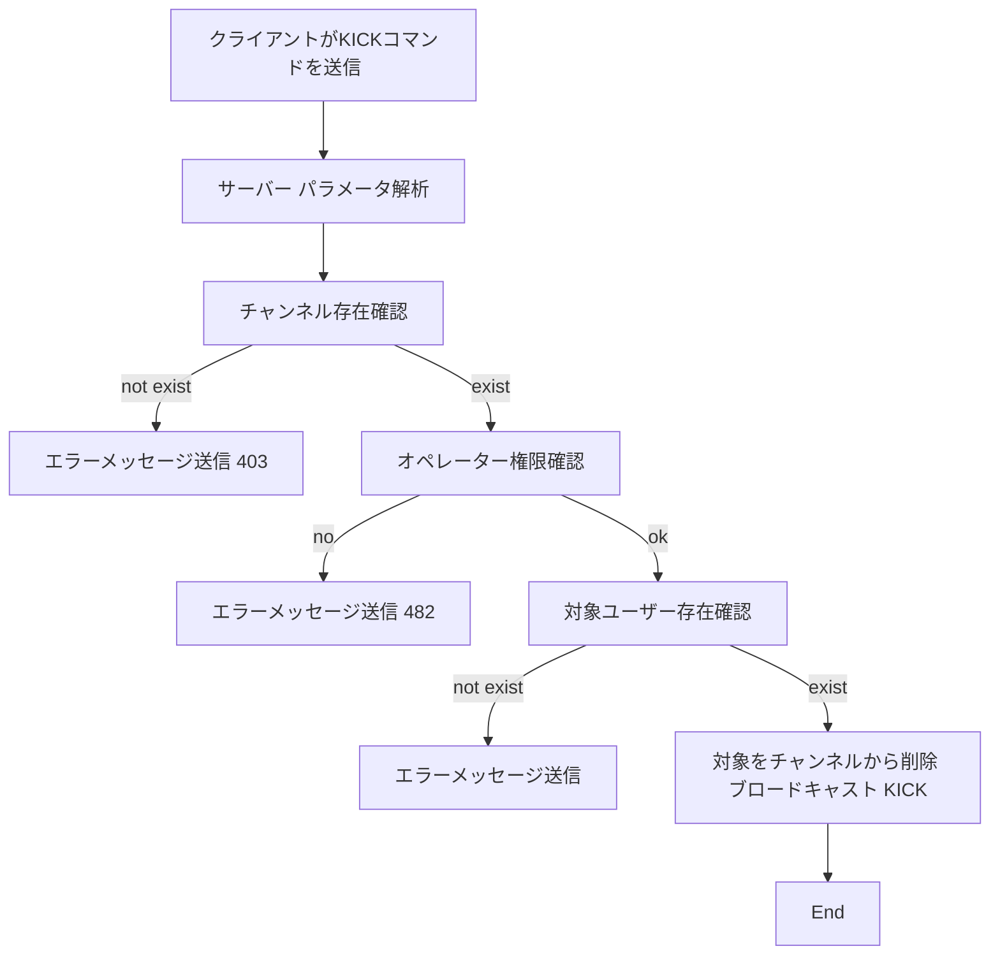
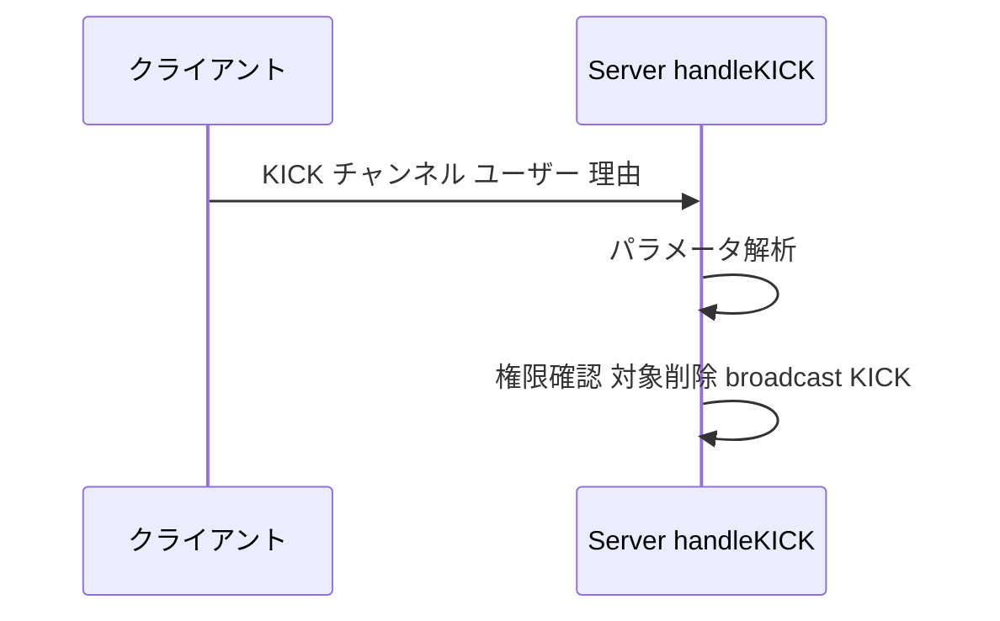

```mermaid
flowchart TD
    Start[クライアントがKICKコマンドを送信]
    Parse[サーバー パラメータ解析]
    Start --> Parse

    Parse --> ChannelCheck[チャンネル存在確認]
    ChannelCheck -->|not exist| Error403[エラーメッセージ送信 403]
    ChannelCheck -->|exist| PrivCheck[オペレーター権限確認]
    PrivCheck -->|no| Error482[エラーメッセージ送信 482]
    PrivCheck -->|ok| TargetCheck[対象ユーザー存在確認]
    TargetCheck -->|not exist| ErrorUser[エラーメッセージ送信]
    TargetCheck -->|exist| DoKick[対象をチャンネルから削除 ブロードキャスト KICK]
    DoKick --> End
```

```mermaid
sequenceDiagram
    participant Client as クライアント
    participant Server as Server handleKICK
    Client->>Server: KICK チャンネル ユーザー 理由
    Server->>Server: パラメータ解析
    Server->>Server: 権限確認 対象削除 broadcast KICK
```
