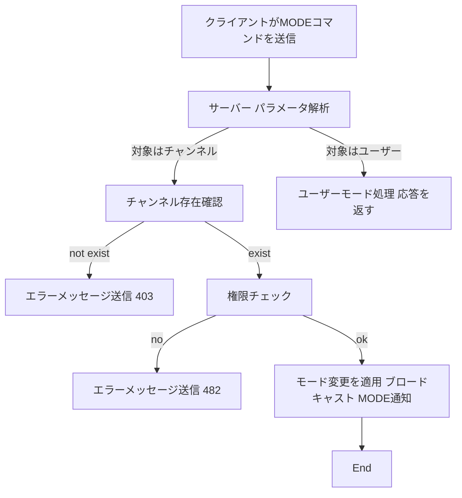
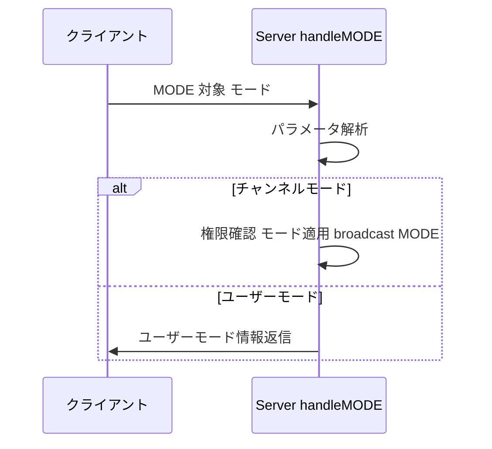

```mermaid
flowchart TD
    Start[クライアントがMODEコマンドを送信]
    Parse[サーバー パラメータ解析]
    Start --> Parse

    Parse -->|対象はチャンネル| ChannelCheck[チャンネル存在確認]
    ChannelCheck -->|not exist| Error403[エラーメッセージ送信 403]
    ChannelCheck -->|exist| PrivCheck[権限チェック]
    PrivCheck -->|no| Error482[エラーメッセージ送信 482]
    PrivCheck -->|ok| Apply[モード変更を適用 ブロードキャスト MODE通知]
    Apply --> End

    Parse -->|対象はユーザー| UserFlow[ユーザーモード処理 応答を返す]
```

```mermaid
sequenceDiagram
    participant Client as クライアント
    participant Server as Server handleMODE
    Client->>Server: MODE 対象 モード
    Server->>Server: パラメータ解析
    alt チャンネルモード
        Server->>Server: 権限確認 モード適用 broadcast MODE
    else ユーザーモード
        Server->>Client: ユーザーモード情報返信
    end
```
