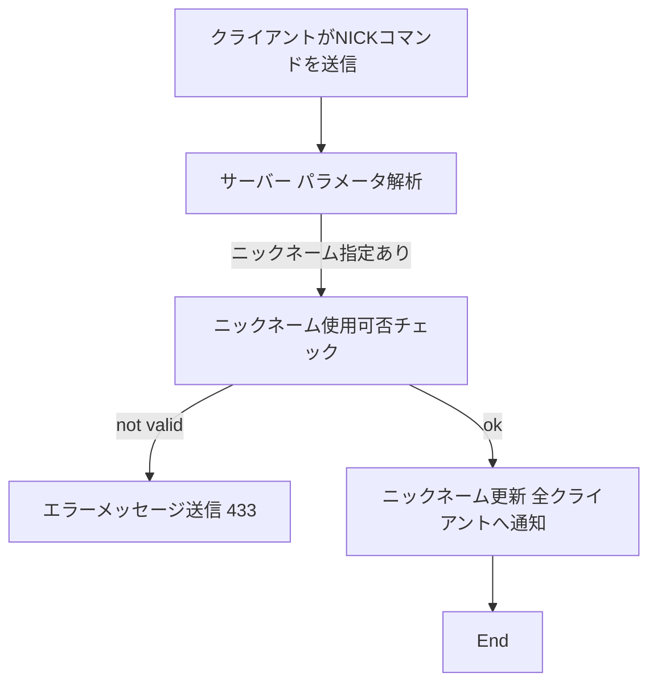
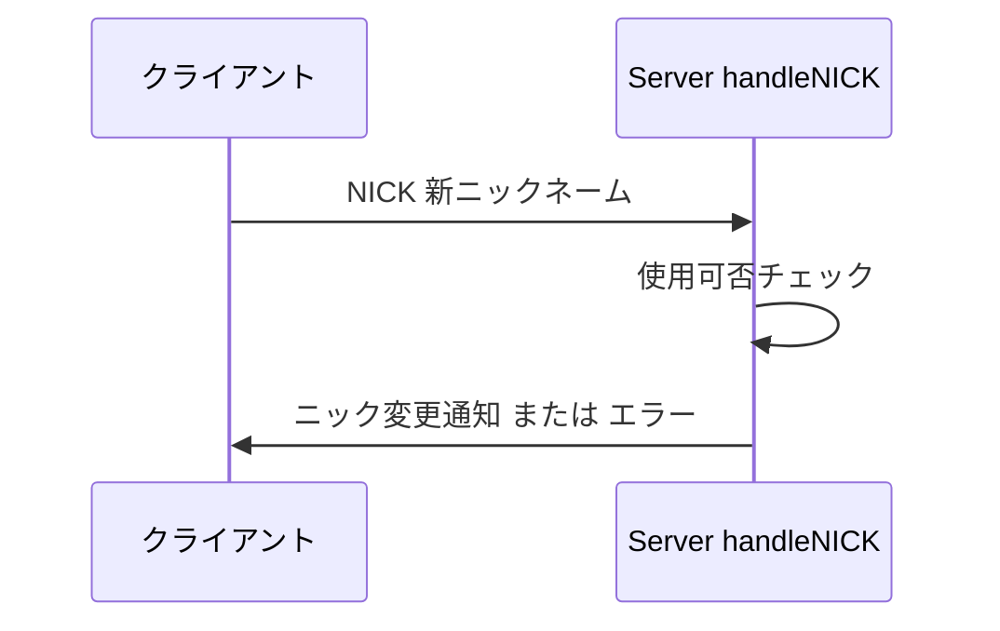

```mermaid
flowchart TD
    Start[クライアントがNICKコマンドを送信]
    Parse[サーバー パラメータ解析]
    Start --> Parse

    Parse -->|ニックネーム指定あり| ValidCheck[ニックネーム使用可否チェック]
    ValidCheck -->|not valid| Error[エラーメッセージ送信 433]
    ValidCheck -->|ok| Apply[ニックネーム更新 全クライアントへ通知]
    Apply --> End
```

```mermaid
sequenceDiagram
    participant Client as クライアント
    participant Server as Server handleNICK
    Client->>Server: NICK 新ニックネーム
    Server->>Server: 使用可否チェック
    Server->>Client: ニック変更通知 または エラー
```
