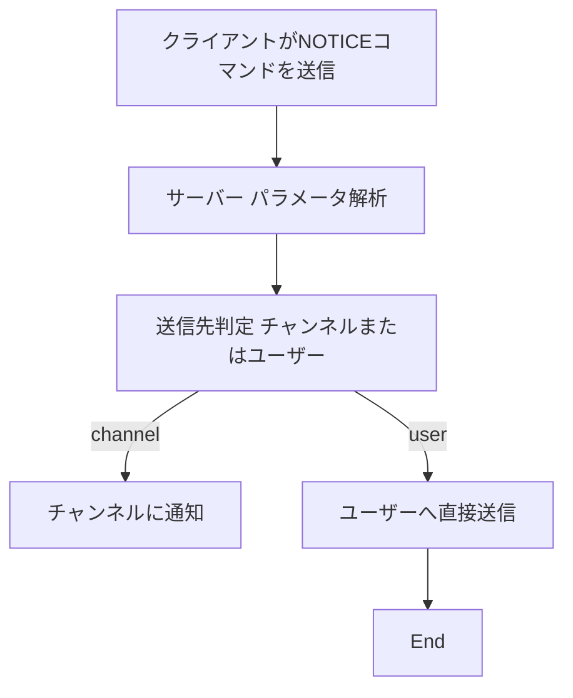
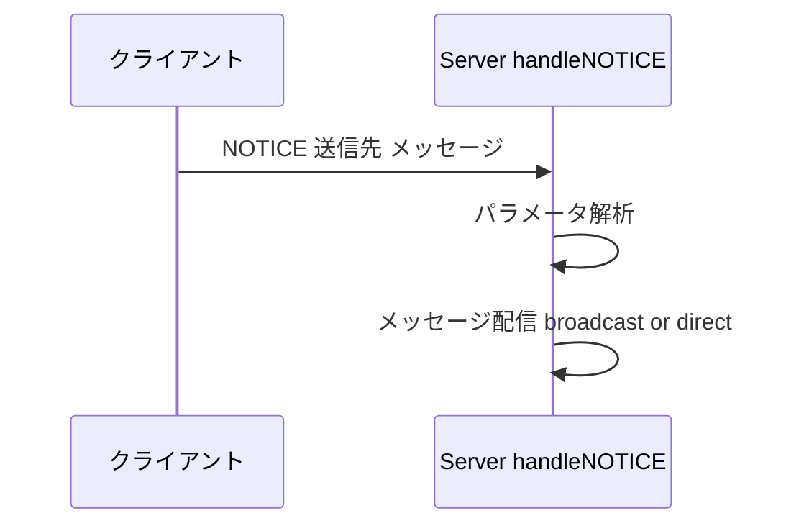

```mermaid
flowchart TD
    Start[クライアントがNOTICEコマンドを送信]
    Parse[サーバー パラメータ解析]
    Start --> Parse

    Parse --> RecipientCheck[送信先判定 チャンネルまたはユーザー]
    RecipientCheck -->|channel| Broadcast[チャンネルに通知]
    RecipientCheck -->|user| Direct[ユーザーへ直接送信]
    Direct --> End
```

```mermaid
sequenceDiagram
    participant Client as クライアント
    participant Server as Server handleNOTICE
    Client->>Server: NOTICE 送信先 メッセージ
    Server->>Server: パラメータ解析
    Server->>Server: メッセージ配信 broadcast or direct
```
