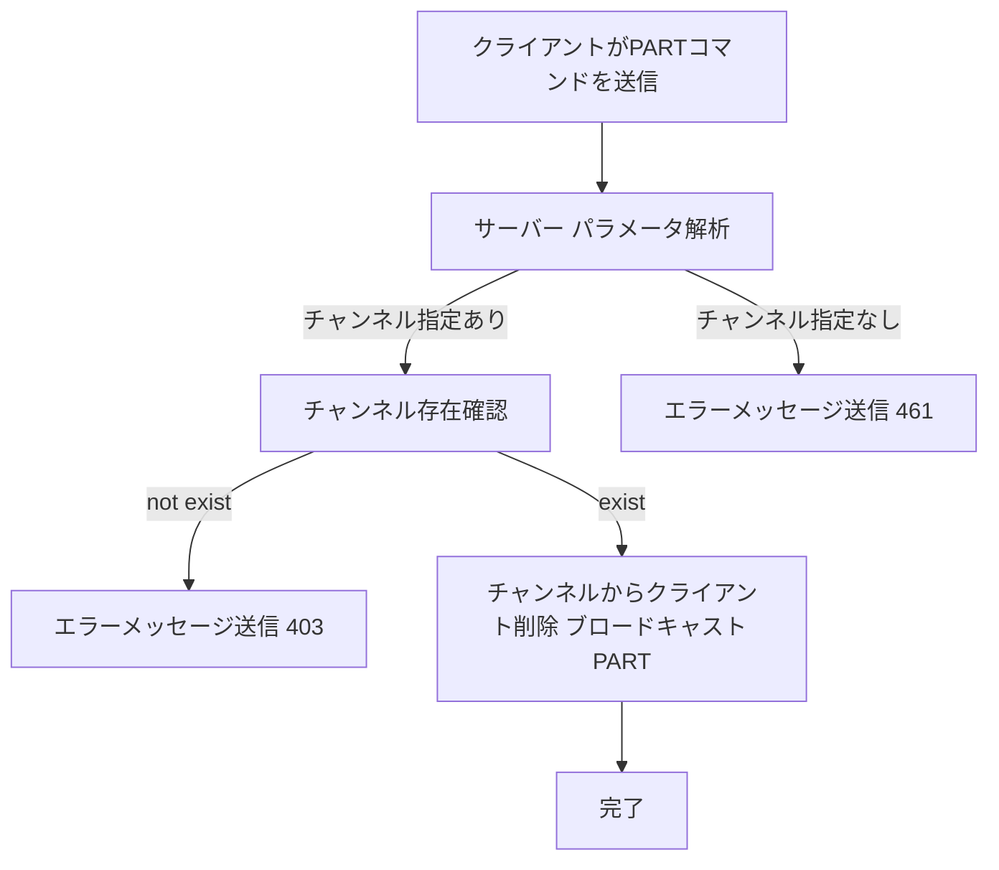
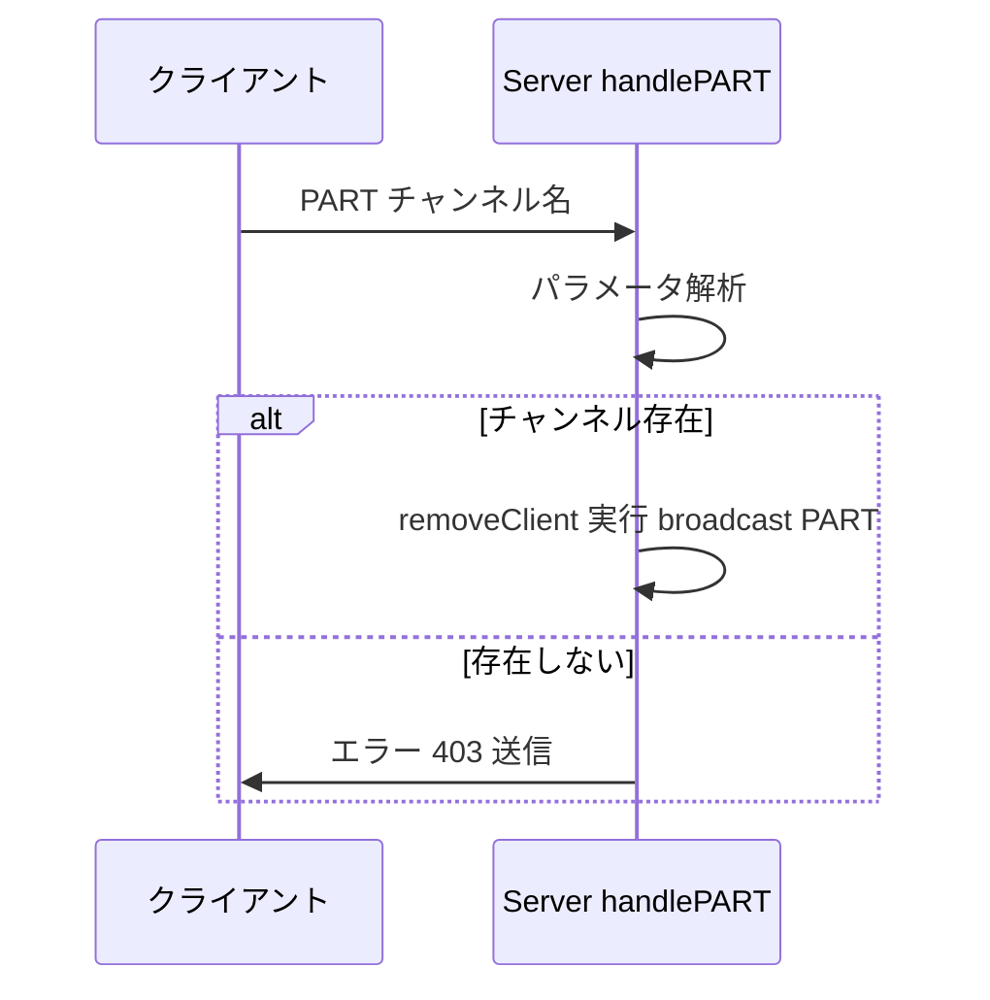

```mermaid
flowchart TD
    Start[クライアントがPARTコマンドを送信]
    Parse[サーバー パラメータ解析]
    Start --> Parse

    Parse -->|チャンネル指定あり| ChannelCheck[チャンネル存在確認]
    ChannelCheck -->|not exist| Error[エラーメッセージ送信 403]
    ChannelCheck -->|exist| Remove[チャンネルからクライアント削除 ブロードキャスト PART]
    Remove --> End[完了]

    Parse -->|チャンネル指定なし| ErrorParam[エラーメッセージ送信 461]
```

```mermaid
sequenceDiagram
    participant Client as クライアント
    participant Server as Server handlePART
    Client->>Server: PART チャンネル名
    Server->>Server: パラメータ解析
    alt チャンネル存在
        Server->>Server: removeClient 実行 broadcast PART
    else 存在しない
        Server->>Client: エラー 403 送信
    end
```
