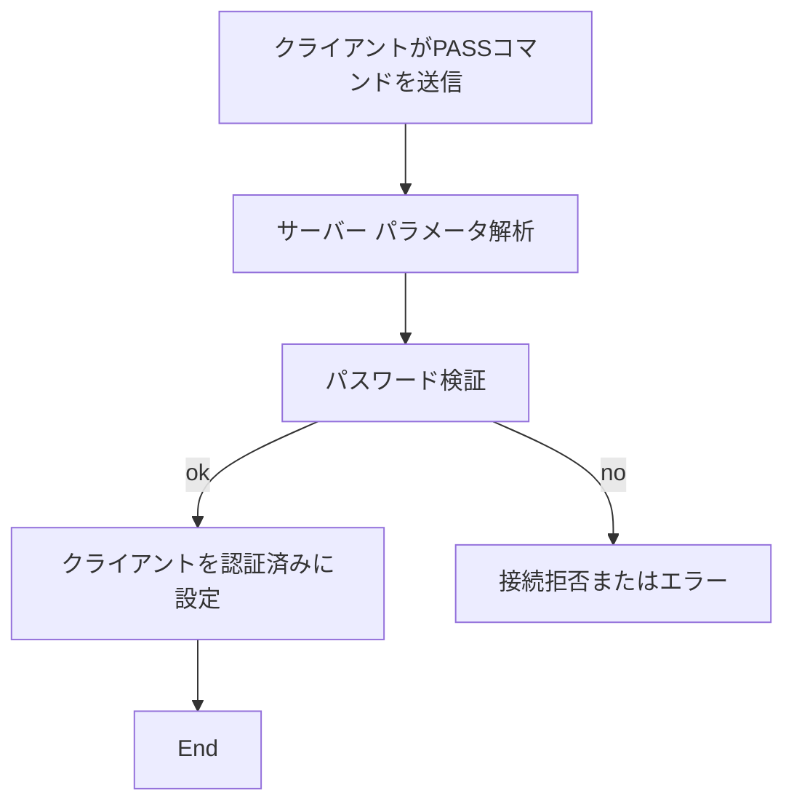
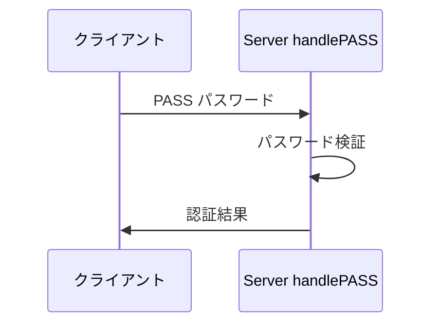

```mermaid
flowchart TD
    Start[クライアントがPASSコマンドを送信]
    Parse[サーバー パラメータ解析]
    Start --> Parse

    Parse --> AuthCheck[パスワード検証]
    AuthCheck -->|ok| MarkAuth[クライアントを認証済みに設定]
    AuthCheck -->|no| Reject[接続拒否またはエラー]
    MarkAuth --> End
```

```mermaid
sequenceDiagram
    participant Client as クライアント
    participant Server as Server handlePASS
    Client->>Server: PASS パスワード
    Server->>Server: パスワード検証
    Server->>Client: 認証結果
```
