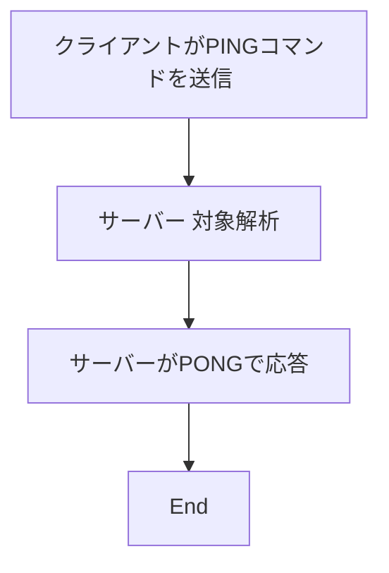
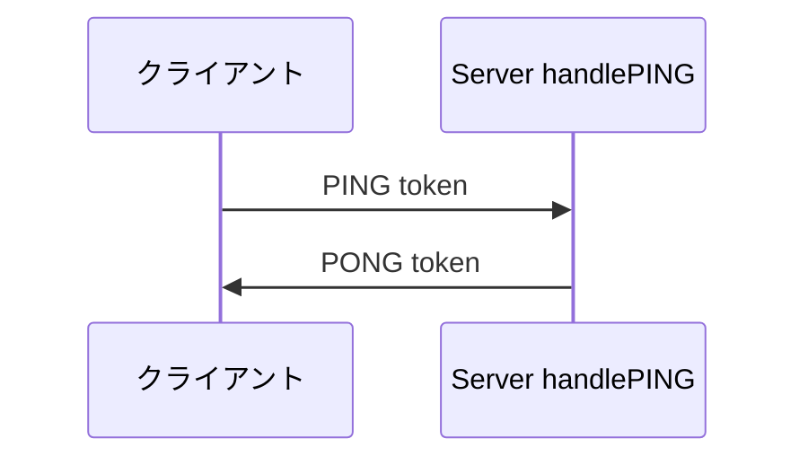

```mermaid
flowchart TD
    Start[クライアントがPINGコマンドを送信]
    Parse[サーバー 対象解析]
    Start --> Parse

    Parse --> Pong[サーバーがPONGで応答]
    Pong --> End
```

```mermaid
sequenceDiagram
    participant Client as クライアント
    participant Server as Server handlePING
    Client->>Server: PING token
    Server->>Client: PONG token
```
