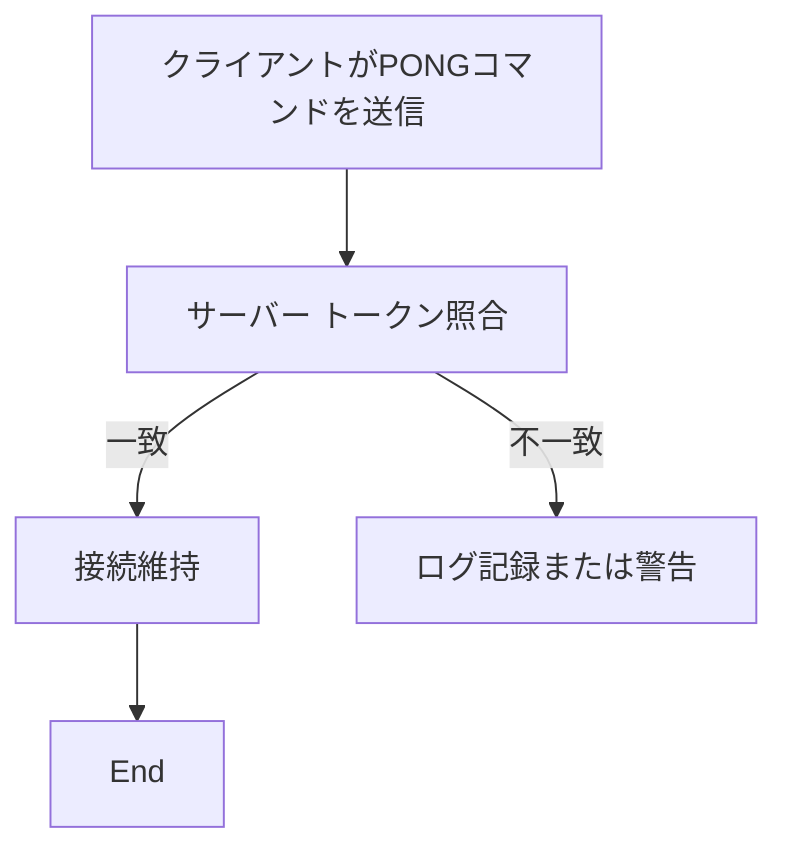
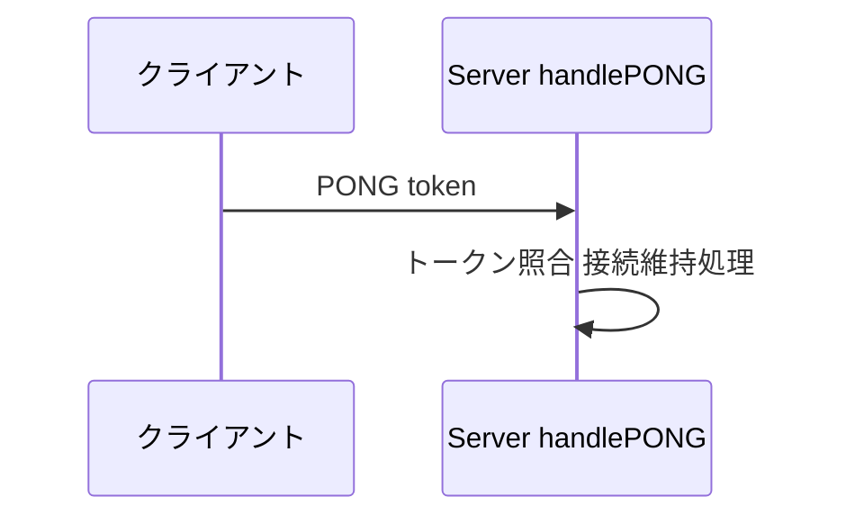

```mermaid
flowchart TD
    Start[クライアントがPONGコマンドを送信]
    Parse[サーバー トークン照合]
    Start --> Parse

    Parse -->|一致| KeepAlive[接続維持]
    Parse -->|不一致| Log[ログ記録または警告]
    KeepAlive --> End
```

```mermaid
sequenceDiagram
    participant Client as クライアント
    participant Server as Server handlePONG
    Client->>Server: PONG token
    Server->>Server: トークン照合 接続維持処理
```
