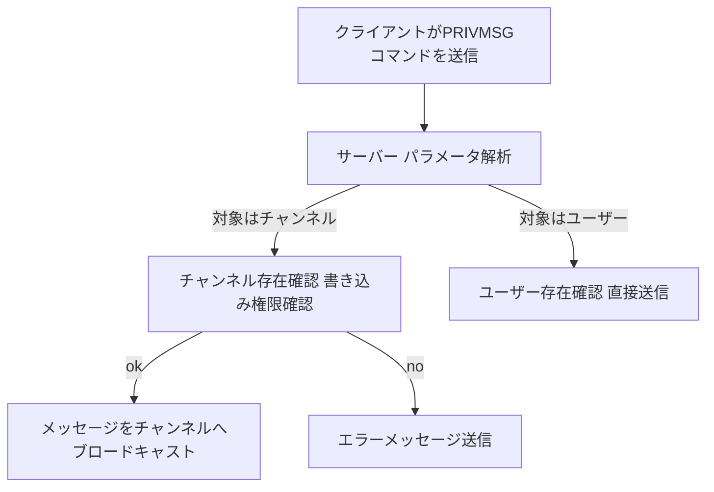
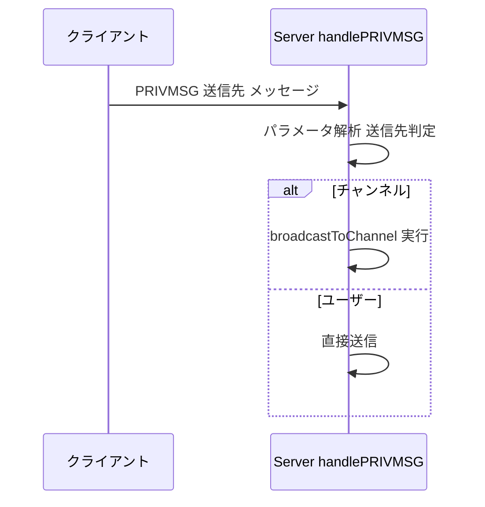

```mermaid
flowchart TD
    Start[クライアントがPRIVMSGコマンドを送信]
    Parse[サーバー パラメータ解析]
    Start --> Parse

    Parse -->|対象はチャンネル| ChannelCheck[チャンネル存在確認 書き込み権限確認]
    ChannelCheck -->|ok| Broadcast[メッセージをチャンネルへブロードキャスト]
    ChannelCheck -->|no| Error[エラーメッセージ送信]

    Parse -->|対象はユーザー| UserCheck[ユーザー存在確認 直接送信]
```

```mermaid
sequenceDiagram
    participant Client as クライアント
    participant Server as Server handlePRIVMSG
    Client->>Server: PRIVMSG 送信先 メッセージ
    Server->>Server: パラメータ解析 送信先判定
    alt チャンネル
        Server->>Server: broadcastToChannel 実行
    else ユーザー
        Server->>Server: 直接送信
    end
```
