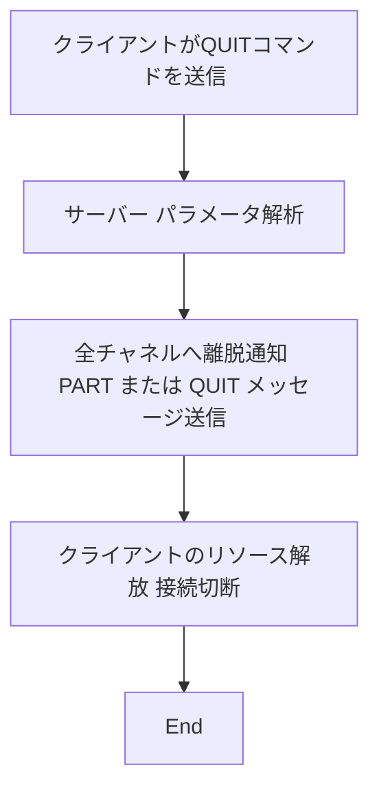
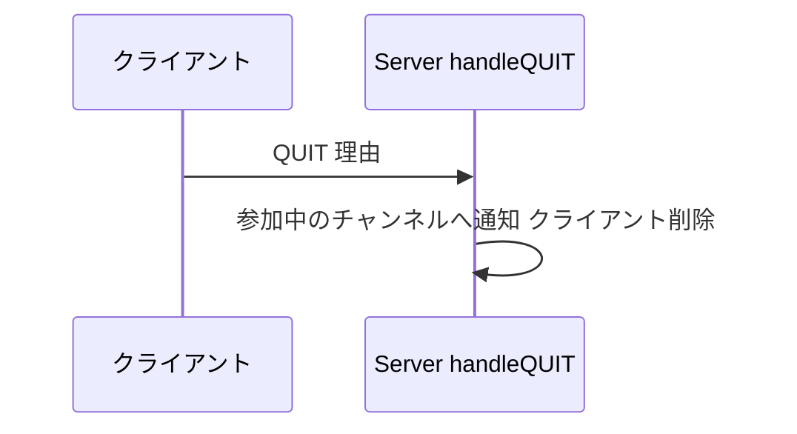

```mermaid
flowchart TD
    Start[クライアントがQUITコマンドを送信]
    Parse[サーバー パラメータ解析]
    Start --> Parse

    Parse --> Broadcast[全チャネルへ離脱通知 PART または QUIT メッセージ送信]
    Broadcast --> Cleanup[クライアントのリソース解放 接続切断]
    Cleanup --> End
```

```mermaid
sequenceDiagram
    participant Client as クライアント
    participant Server as Server handleQUIT
    Client->>Server: QUIT 理由
    Server->>Server: 参加中のチャンネルへ通知 クライアント削除
```
