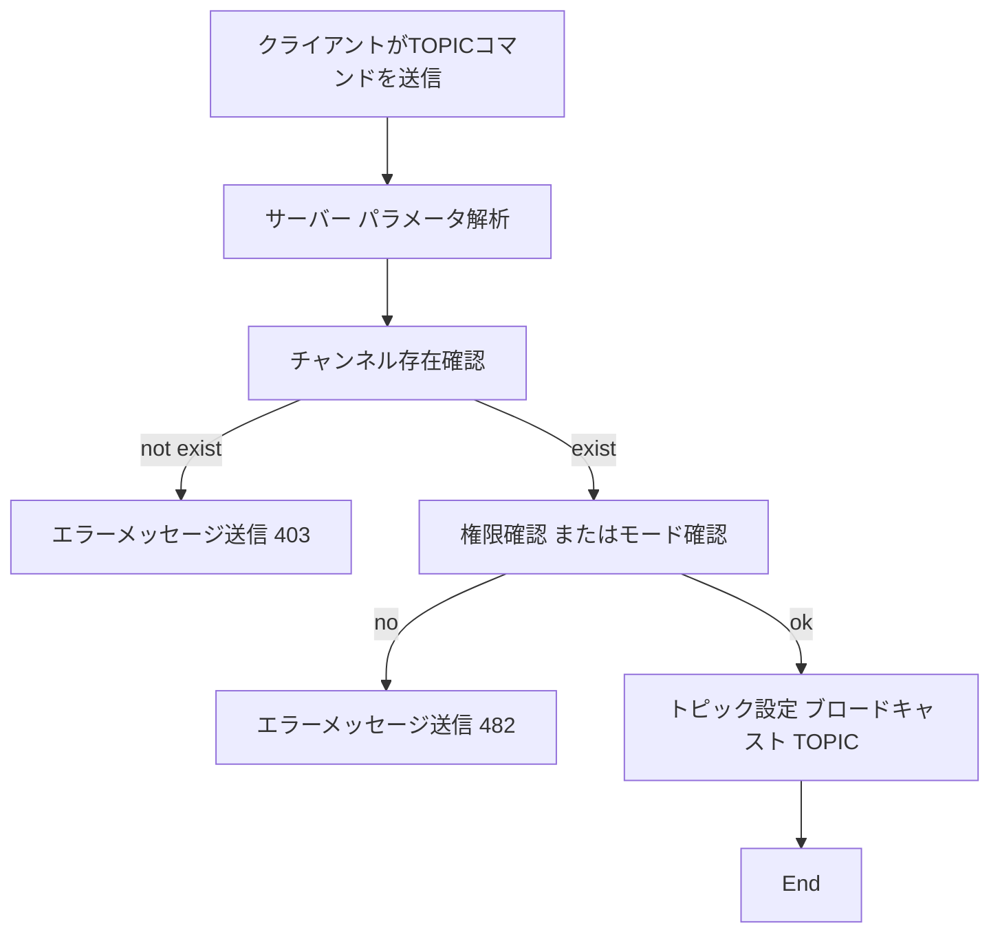
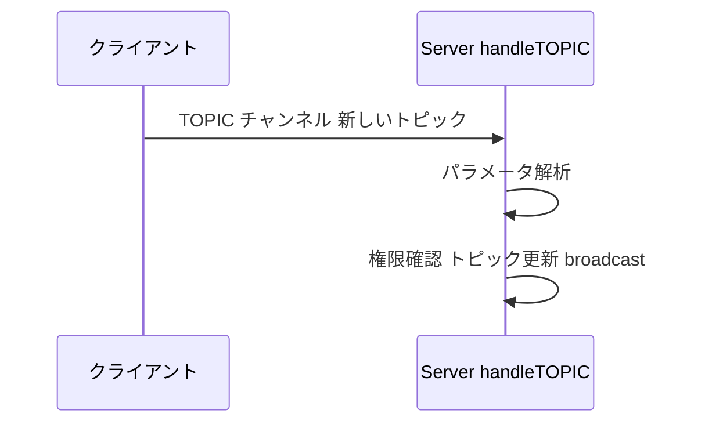

```mermaid
flowchart TD
    Start[クライアントがTOPICコマンドを送信]
    Parse[サーバー パラメータ解析]
    Start --> Parse

    Parse --> ChannelCheck[チャンネル存在確認]
    ChannelCheck -->|not exist| Error403[エラーメッセージ送信 403]
    ChannelCheck -->|exist| PrivCheck[権限確認 またはモード確認]
    PrivCheck -->|no| Error482[エラーメッセージ送信 482]
    PrivCheck -->|ok| SetTopic[トピック設定 ブロードキャスト TOPIC]
    SetTopic --> End
```

```mermaid
sequenceDiagram
    participant Client as クライアント
    participant Server as Server handleTOPIC
    Client->>Server: TOPIC チャンネル 新しいトピック
    Server->>Server: パラメータ解析
    Server->>Server: 権限確認 トピック更新 broadcast
```
