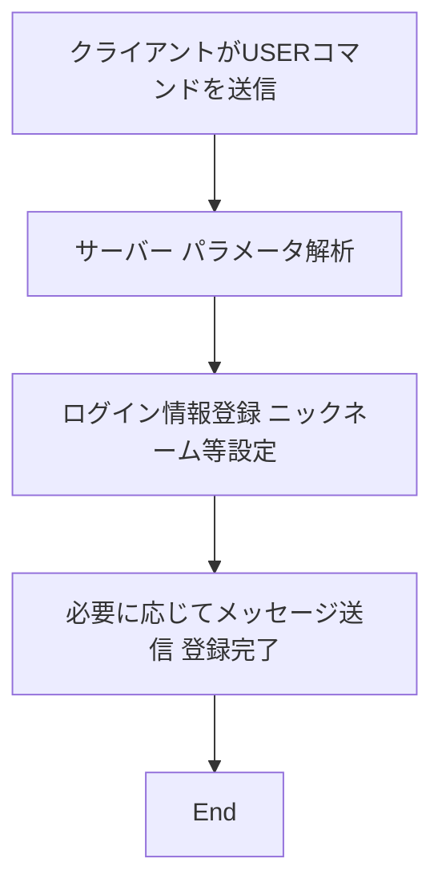
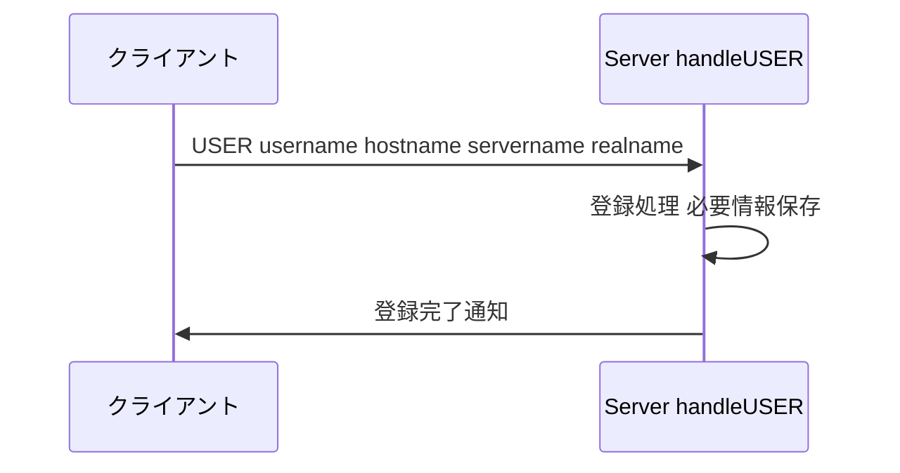

```mermaid
flowchart TD
    Start[クライアントがUSERコマンドを送信]
    Parse[サーバー パラメータ解析]
    Start --> Parse

    Parse --> Register[ログイン情報登録 ニックネーム等設定]
    Register --> Welcome[必要に応じてメッセージ送信 登録完了]
    Welcome --> End
```

```mermaid
```mermaid
sequenceDiagram
    participant Client as クライアント
    participant Server as Server handleUSER
    Client->>Server: USER username hostname servername realname
    Server->>Server: 登録処理 必要情報保存
    Server->>Client: 登録完了通知
```
