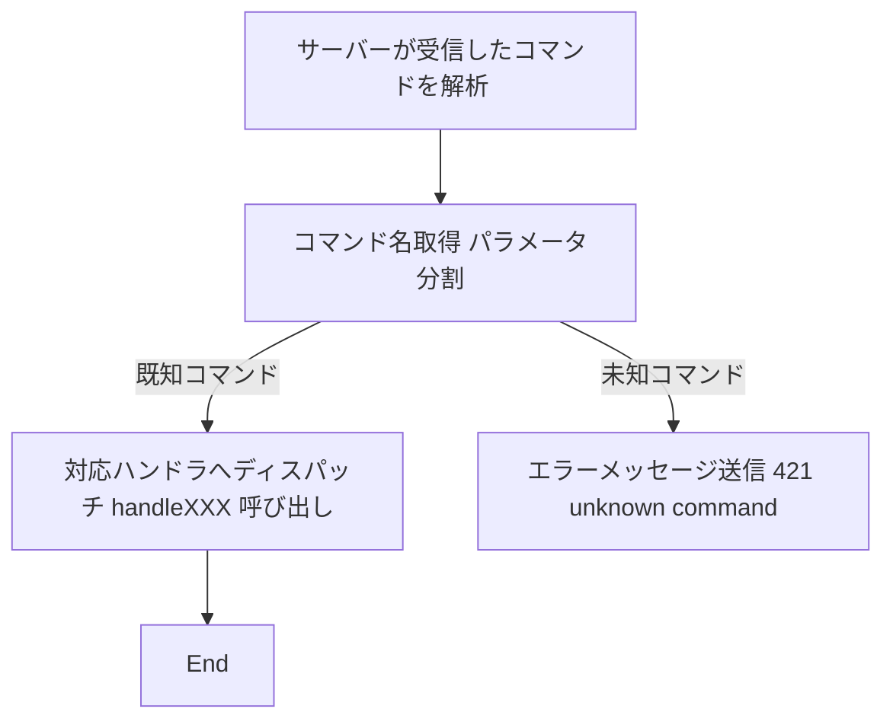
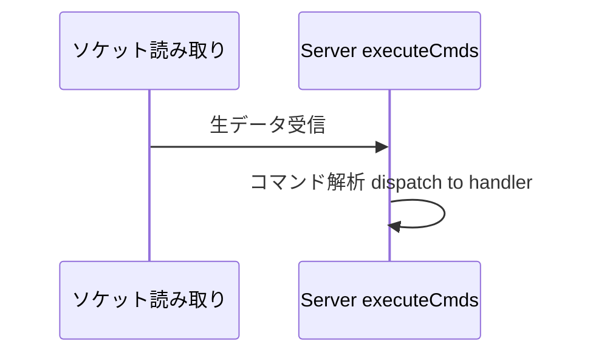

```mermaid
flowchart TD
    Start[サーバーが受信したコマンドを解析]
    Parse[コマンド名取得 パラメータ分割]
    Start --> Parse

    Parse -->|既知コマンド| Dispatch[対応ハンドラへディスパッチ handleXXX 呼び出し]
    Parse -->|未知コマンド| Unknown[エラーメッセージ送信 421 unknown command]
    Dispatch --> End
```

```mermaid
sequenceDiagram
    participant Socket as ソケット読み取り
    participant Server as Server executeCmds
    Socket->>Server: 生データ受信
    Server->>Server: コマンド解析 dispatch to handler
```
